# Task
```
写一个测试用例，通过不同的GC参数（Serial GC，Parallel Scavenge，G1GC，ZGC，Shenandoah GC），通过打印GC日志完整的展示GC的各个阶段
```

# Environment
+ Ubuntu 18.04.6 LTS
+ java-17-openjdk-amd64

# Result
+ 使用[LRUCache](../demo/src/main/java/com/example/LRUCache_test.java)代码作为测试用例
+ 日志文件位于[log_pro1](../log/log_pro1)文件夹
## Serial GC
### Settings
```json
"vmArgs": [
                "-Xlog:gc*:log/log_pro1/gc-%t.log:time,level,tags",
                "-XX:+UseSerialGC",
            ],
```
### LOG
+ Total time: 39193ms
+ configure:
    + 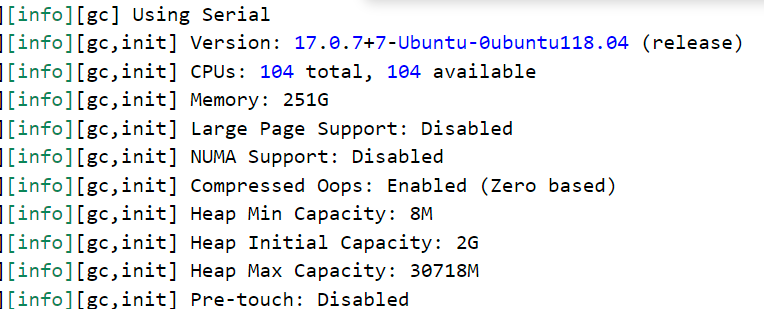
+ log result:
    + 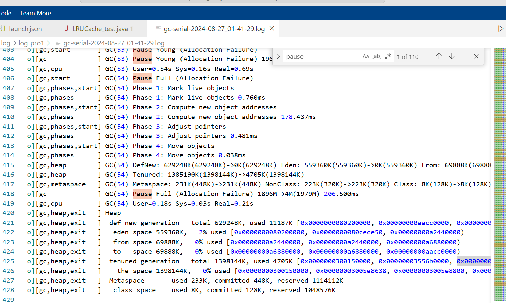
### GC stage and pause time
+ stage: Young GC (Take the last young GC stage as example)
    + pause time:
        + Pause Young (Allocation Failure) 1967M->1896M(2442M) 693.925ms
        + User=0.54s Sys=0.16s Real=0.69s
+ stage: Full GC
    + pause time:
        + Pause Full (Allocation Failure) 1896M->4M(1979M) 206.500ms
        ```
        Phase 1: Mark live objects
        Phase 1: Mark live objects 0.760ms
        Phase 2: Compute new object addresses
        Phase 2: Compute new object addresses 178.437ms
        Phase 3: Adjust pointers
        Phase 3: Adjust pointers 0.481ms
        Phase 4: Move objects
        Phase 4: Move objects 0.038ms
        ```
        + User=0.18s Sys=0.03s Real=0.21s

## Parallel Scavenge
### Settings
```json
"vmArgs": [
                "-Xlog:gc*:log/log_pro1/gc-%t.log:time,level,tags",
                "-XX:+UseParallelGC",
            ],
```
### LOG
+ Total time: 26985ms
+ configure:
    + 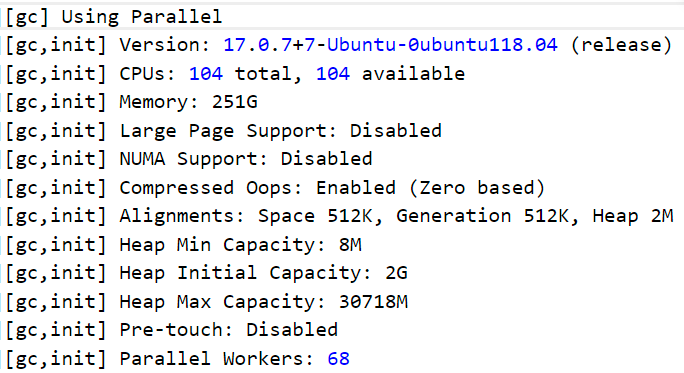
+ log result:
    + 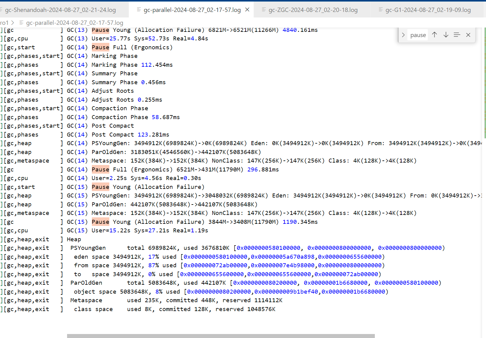
### GC stage and pause time
+ stage: Young GC
    + pause time: 
        + Pause Young (Allocation Failure) 6821M->6521M(11266M) 4840.161ms
        + User=25.77s Sys=52.73s Real=4.84s
+ stage: Full GC
    + pause time:
        ```
        Pause Full (Ergonomics)
        Marking Phase
        Marking Phase 112.454ms
        Summary Phase
        Summary Phase 0.456ms
        Adjust Roots
        Adjust Roots 0.255ms
        Compaction Phase
        Compaction Phase 58.687ms
        Post Compact
        Post Compact 123.281ms
        PSYoungGen: 3494912K(6989824K)->0K(6989824K) Eden: 0K(3494912K)->0K(3494912K) From: 3494912K
        ParOldGen: 3183051K(4546560K)->442107K(5083648K)
        Metaspace: 152K(384K)->152K(384K) NonClass: 147K(256K)->147K(256K) Class: 4K(128K)->4K(128K)
        ```
        + Pause Full (Ergonomics) 6521M->431M(11790M) 296.881ms
        + User=2.25s Sys=4.56s Real=0.30s
    

## G1GC
### Settings
```json
"vmArgs": [
                "-Xlog:gc*:log/log_pro1/gc-%t.log:time,level,tags",
                "-XX:+UseG1GC",
            ],
```
### LOG
+ Total time: 19870ms
+ configure:
    + 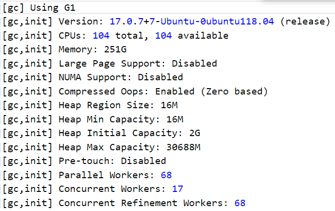
+ log result:
    + 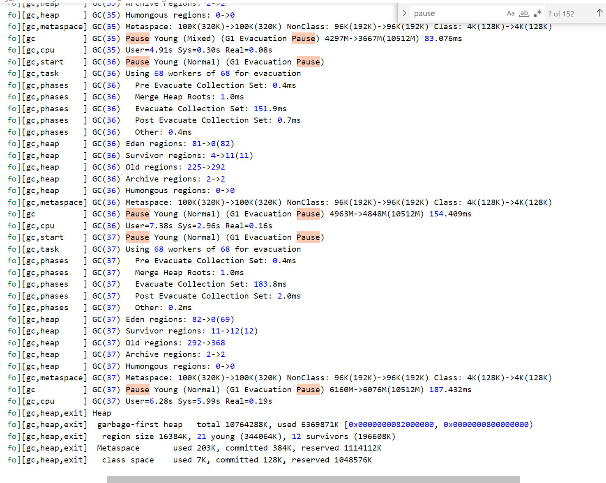
### GC stage and pause time
+ stage: Young GC
    + pause time:
        ```
        Pause Young (Normal) (G1 Evacuation Pause) 4963M->4848M(10512M) 154.409ms
        User=7.38s Sys=2.96s Real=0.16s
        Pause Young (Normal) (G1 Evacuation Pause)
        Using 68 workers of 68 for evacuation
        Pre Evacuate Collection Set: 0.4ms
        Merge Heap Roots: 1.0ms
        Evacuate Collection Set: 183.8ms
        Post Evacuate Collection Set: 2.0ms
        Other: 0.2ms
        Eden regions: 82->0(69)
        Survivor regions: 11->12(12)
        Old regions: 292->368
        Archive regions: 2->2
        Humongous regions: 0->0
        ```
+ stage: Mixed GC
    + pause time:
        ```
        Pause Young (Prepare Mixed) (G1 Evacuation Pause) 3929M->3913M(10512M) 110.494ms
        User=6.34s Sys=0.98s Real=0.12s
        Pause Young (Mixed) (G1 Evacuation Pause)
        Using 68 workers of 68 for evacuation
        Pre Evacuate Collection Set: 0.3ms
        Merge Heap Roots: 1.1ms
        Evacuate Collection Set: 80.6ms
        Post Evacuate Collection Set: 0.8ms
        Other: 0.3ms
        Eden regions: 24->0(81)
        Survivor regions: 8->4(4)
        Old regions: 236->225
        Archive regions: 2->2
        Humongous regions: 0->0
        Metaspace: 100K(320K)->100K(320K) NonClass: 96K(192K)->96K(192K) Class: 4K(128K)->4K(128K)
        Pause Young (Mixed) (G1 Evacuation Pause) 4297M->3667M(10512M) 83.076ms
        User=4.91s Sys=0.30s Real=0.08s
        ```
+ stage: Concurrent Marking
    + pause time:
        ```
        GC(32) Pause Young (Concurrent Start) (G1 Evacuation
        GC(32) User=4.72s Sys=7.88s Real=0.19s
        GC(33) Concurrent Mark Cycle
        GC(33) Concurrent Clear Claimed Marks
        GC(33) Concurrent Clear Claimed Marks 0.012ms
        GC(33) Concurrent Scan Root Regions
        GC(33) Concurrent Scan Root Regions 31.481ms
        GC(33) Concurrent Mark
        GC(33) Concurrent Mark From Roots
        GC(33) Using 17 workers of 17 for marking
        GC(33) Concurrent Mark From Roots 23.026ms
        GC(33) Concurrent Preclean
        GC(33) Concurrent Preclean 0.538ms
        GC(33) Pause Remark
        GC(33) Pause Remark 5699M->3121M(10512M) 2.231ms
        GC(33) User=0.02s Sys=0.01s Real=0.00s
        GC(33) Concurrent Mark 26.428ms
        GC(33) Concurrent Rebuild Remembered Sets
        GC(33) Concurrent Rebuild Remembered Sets 210.422ms
        GC(33) Pause Cleanup
        GC(33) Pause Cleanup 3329M->3329M(10512M) 0.928ms
        GC(33) User=0.01s Sys=0.01s Real=0.00s
        GC(33) Concurrent Cleanup for Next Mark
        GC(33) Concurrent Cleanup for Next Mark 32.300ms
        GC(33) Concurrent Mark Cycle 302.574ms
        ```
+ stage: Full GC(该进程运行过程未发生full gc，以其它进程full GC结果为例)
    + pause time: 
    ```
    Attempting full compaction
    GC(5193) Concurrent Mark Cycle
    GC(5194) Using 12 workers of 68 for full compaction
    GC(5193) Concurrent Clear Claimed Marks
    GC(5193) Concurrent Clear Claimed Marks 0.032ms
    GC(5193) Concurrent Scan Root Regions
    GC(5194) Pause Full (G1 Compaction Pause)
    GC(5193) Concurrent Scan Root Regions 0.493ms
    GC(5193) Concurrent Mark
    GC(5193) Concurrent Mark From Roots
    GC(5193) Using 17 workers of 17 for marking
    GC(5194) Phase 1: Mark live objects
    GC(5194) Phase 1: Mark live objects 22.146ms
    GC(5194) Phase 2: Prepare for compaction
    GC(5194) Phase 2: Prepare for compaction 4.137ms
    GC(5194) Phase 3: Adjust pointers
    GC(5194) Phase 3: Adjust pointers 17.768ms
    GC(5194) Phase 4: Compact heap
    GC(5194) Phase 4: Compact heap 9.969ms
    GC(5194) Eden regions: 0->0(25)
    GC(5194) Survivor regions: 4->0(4)
    GC(5194) Old regions: 501->442
    GC(5194) Archive regions: 2->2
    GC(5194) Humongous regions: 5->5
    GC(5194) Metaspace: 100K(320K)->100K(320K) NonClass: 96K(192K)->96K(192K) Class: 4K(128K)->4K(128K)
    GC(5194) Pause Full (G1 Compaction Pause) 505M->441M(512M) 55.836ms
    GC(5194) User=0.62s Sys=0.01s Real=0.05s
    GC(5193) Concurrent Mark From Roots 55.706ms
    GC(5193) Concurrent Mark Abort
    GC(5193) Concurrent Mark Cycle 56.352ms
    GC(5195) Pause Young (Normal) (G1 Evacuation Pause)
    GC(5195) Using 12 workers of 68 for evacuation
    GC(5195)   Pre Evacuate Collection Set: 0.1ms
    GC(5195)   Merge Heap Roots: 0.1ms
    GC(5195)   Evacuate Collection Set: 5.9ms
    GC(5195)   Post Evacuate Collection Set: 0.2ms
    GC(5195)   Other: 0.2ms
    GC(5195) Eden regions: 25->0(21)
    GC(5195) Survivor regions: 0->4(4)
    GC(5195) Old regions: 442->464
    GC(5195) Archive regions: 2->2
    GC(5195) Humongous regions: 5->5
    GC(5195) Metaspace: 100K(320K)->100K(320K) NonClass: 96K(192K)->96K(192K) Class: 4K(128K)->4K(128K)
    ```

## ZGC
### Settings
```json
"vmArgs": [
                "-Xlog:gc*:log/log_pro1/gc-%t.log:time,level,tags",
                "-XX:+UseZGC",
            ],
```
### LOG
+ Total time: 18905ms
+ configure:
    + 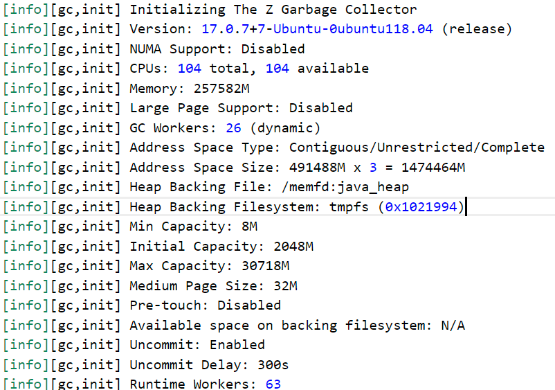
+ log result:
    + 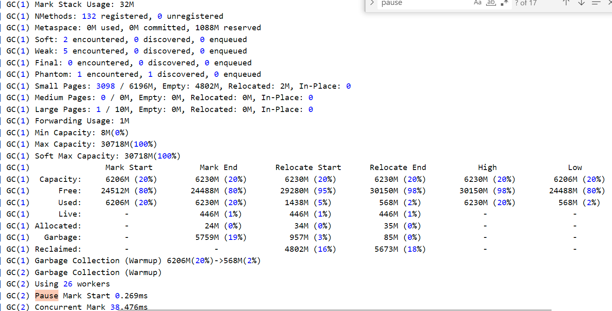
    + 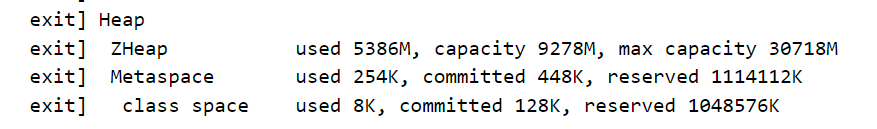
### GC stage and pause time
+ stage: concurrent marking、concurrent relocation、 concurrent remap、 pause mark state、 pause mark end
    + pause time:
    ```
    Phase: Concurrent Mark                              47.941 / 57.406
    Phase: Concurrent Mark Continue                      0.000 / 0.000 
    Phase: Concurrent Mark Free                          0.002 / 0.002 
    Phase: Concurrent Process Non-Strong References      0.426 / 0.439 
    Phase: Concurrent Relocate                           2.668 / 3.244 
    Phase: Concurrent Reset Relocation Set               1.501 / 2.869 
    Phase: Concurrent Select Relocation Set             14.456 / 20.701
    Phase: Pause Mark End                                0.037 / 0.048 
    Phase: Pause Mark Start                              0.147 / 0.269 
    Phase: Pause Relocate Start                          0.010 / 0.011 
    ```

## Shenandoah 
### Settings
```json
"vmArgs": [
                "-Xlog:gc*:log/log_pro1/gc-%t.log:time,level,tags",
                "-XX:+UseShenandoahGC",
            ],
```
### LOG
+ Total time: 18208ms
+ configure: 
    + 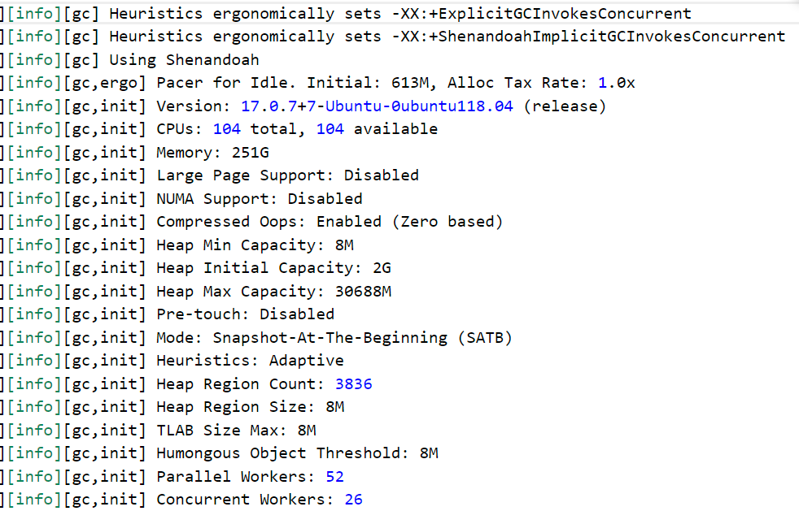
+ log result:
    + 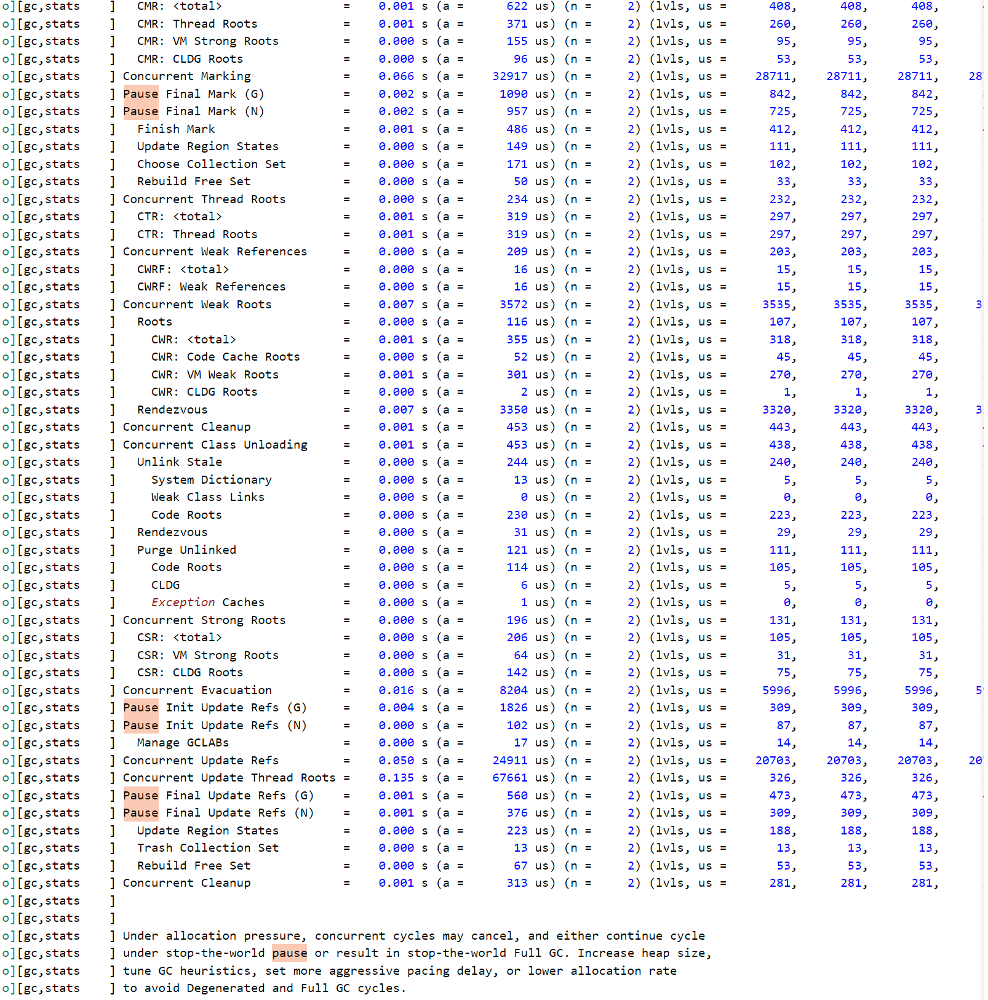
### GC stage and pause time
+ stage: concurrent marking、 concurrent evacuation、concurrent update reference、pause init update reference、 pause final update reference
    + pause time:
    ```
    Concurrent Reset                  16244 us
    Pause Init Mark (G)                 416 us
    Pause Init Mark (N)                 260 us
    Update Region States              159 us
    Concurrent Mark Roots               198 us
    CMR: <total>                      408 us
    CMR: Thread Roots                 260 us
    CMR: VM Strong Roots               95 us
    CMR: CLDG Roots                    53 us
    Concurrent Marking                28821 us
    Pause Final Mark (G)                843 us
    Pause Final Mark (N)                726 us
    Finish Mark                       413 us
    Update Region States              112 us
    Choose Collection Set             102 us
    Rebuild Free Set                   33 us
    Concurrent Thread Roots             235 us
    CTR: <total>                      298 us
    CTR: Thread Roots                 298 us
    Concurrent Weak References          215 us
    CWRF: <total>                      17 us
    CWRF: Weak References              17 us
    Concurrent Weak Roots              3542 us
    Roots                             108 us
        CWR: <total>                    319 us
        CWR: Code Cache Roots            45 us
        CWR: VM Weak Roots              271 us
        CWR: CLDG Roots                   2 us
    Rendezvous                       3327 us
    Concurrent Cleanup                  463 us
    Concurrent Class Unloading          439 us
    Unlink Stale                      242 us
        System Dictionary                 5 us
        Weak Class Links                  0 us
        Code Roots                      236 us
    Rendezvous                         29 us
    Purge Unlinked                    112 us
        Code Roots                      106 us
        CLDG                              5 us
        Exception Caches                  1 us
    Concurrent Strong Roots             133 us
    CSR: <total>                      106 us
    CSR: VM Strong Roots               31 us
    CSR: CLDG Roots                    75 us
    Concurrent Evacuation              6002 us
    Pause Init Update Refs (G)         3343 us
    Pause Init Update Refs (N)           87 us
    Manage GCLABs                      14 us
    Concurrent Update Refs            20885 us
    Concurrent Update Thread Roots   134996 us
    Pause Final Update Refs (G)         647 us
    Pause Final Update Refs (N)         442 us
    Update Region States              258 us
    Trash Collection Set               13 us
    Rebuild Free Set                   81 us
    Concurrent Cleanup                  282 us
    [2024-08-27T02:21:38.675+0000][info][gc,stats    ] 
    Allocation pacing accrued:
        0 of  5441 ms (  0.0%): <total>
        0 of  5441 ms (  0.0%): <average total
    ```

# Comparison
Serial GC，Parallel Scavenge，G1GC，ZGC，Shenandoah GC
## total time
|                | Serial GC | Parallel Scavenge | G1GC  | ZGC   | Shenandoah GC |   |   |   |   |
|:--------------:|:---------:|:-----------------:|:-----:|:-----:|:-------------:|:---:|:---:|:---:|:---:|
| Total time（ms） | 39193     | 26985             | 19870 | 18905 | 18208         |   |   |   |   |

## characteristic
 **GC类型** | **Serial GC** | **Parallel Scavenge** | **G1GC**           | **ZGC**         | **Shenandoah GC** 
:--------:|:-------------:|:---------------------:|:------------------:|:---------------:|:-----------------:
 **主要特性** | 单线程、简单        | 多线程、吞吐量优先             | 分区收集、预测性暂停时间       | 并发收集、极低延迟       | 低延迟、并发紧缩           
 **优点**   | 低开销、易调试       | 高吞吐量、并行化              | 可预测的暂停时间、避免Full GC | 超低暂停时间、支持大堆内存   | 低暂停时间、高效大堆支持     
 **缺点**   | 长暂停时间、无法利用多核  | 暂停时间不可预测、不适合低延迟应用     | 配置复杂、适用于中大型堆       | 内存开销较高、JVM版本要求新 | 内存开销较高、调优复杂   


## Conclusion
1. 根据实验，在测试的LRUCache case中，程序运行时间根据Serial GC，Parallel Scavenge，G1GC，ZGC，Shenandoah GC的顺序依次递减。
2. 对比不同的GC算法，serialGC与parallel scavenge在youngGC阶段与fullGC阶段花费的时间相对较长
3. 根据适当的配置，G1GC算法可以通过mixed gc回收老年代，进而避免完全STW的full GC阶段，暂停时间可预测，相对来说暂停时间较短
4. ZGC和Shenandoah GC算法的暂停时间开销小。对于ZGC算法，并发标记阶段的时间开销比重较大；对于Shenandoah GC算法，并发式的根节点更新开销比重较大
