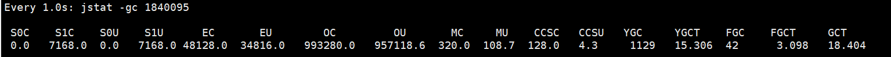

# Task
```
专注于G1GC，写一个JDK的jtreg测试用例，使用一些现有的whitebox API（有必要的话可以自己扩展whitebox API）来实现一个典型的LRU cache，随机的添加LRU cache内容。运行一段时间之后统计old region的对象存活情况。
```

# Environment
+ Ubuntu 18.04.6 LTS
+ java-17-openjdk-amd64

# LRU Cache
+ [LRU cache](../demo/src/main/java/com/example/LRUCache.java)的类实现
+ [LRU cache](../demo/src/main/java/com/example/LRUCache_jtreg_test.java)的测试

# Settings of tested data
+ value：1024 bytes
+ cache_size:400000
+ test_size: 100000000

# Config
```json
"vmArgs": [
    "-Xlog:gc*:log/log_pro2/gc-G1-%t.log:time,level,tags",
    "-XX:+UseG1GC",
    "-Xmx1G"
],
```

# Result:
+ Total time: 60820ms
+ 通过jstat -gc [pid]观察gc信息：
    + 
        ```
        S0C: survivor 0区域的容量，以KB为单位
        S1C: survivor 1区域的容量，以KB为单位
        S0U: survivor 0区域的使用大小，以KB为单位
        S1U: survivor 1区域的使用大小，以KB为单位
        EC: Eden区域的容量，以KB为单位
        EU: Eden区域的使用，以KB为单位
        MC: Metaspace元数据区的 Committed Size，以KB为单位
        MU: Metaspace元数据区的使用大小，以KB为单位
        CCSC: Compressed class的Committed Size，以KB为单位
        CCSU: Compressed class的使用大小，以KB为单位
        OC: old区域的容量，以KB为单位
        OU: old区域的使用，以KB为单位
        YGC: young generation(年轻代)的GC次数
        YGCT: young generation(年轻代)的GC消耗时间
        FGC: full GC的次数
        FGCT: full GC的消耗时间
        CGC: 并发GC次数(G1 gc)
        CGCT: 并发GC的消耗时间(G1 gc)
        GCT: GC总消耗时间
        ```
    + 根据jstat统计可以分析得到，在GCT为18.404时：
        + 在运行过程中，survivor 1区容量为7168KB，当前使用大小为7168KB。
        + Eden区域容量为48128KB，当前使用大小为34816KB。
        + Old区容量为993280KB，当前使用大小为957118KB
        + Young GC次数为1001，平均YGC用时为15.306/1129，约13.6ms
        + full GC次数为42，平均FGC用时为3.098/42，73.8ms
        + 老年代区域较为饱和，并发回收和Mixed GC无法跟上垃圾生成的速度，触发了较多次数的Full GC，进而导致了较多的STW事件，可考虑增大堆空间进行垃圾回收。


## log analysis
+ pause young阶段
    ```
    GC(1476) Pause Young (Concurrent Start) (G1 Evacuation Pause)
    GC(1476) Using 24 workers of 68 for evacuation
    GC(1476)   Pre Evacuate Collection Set: 0.2ms
    GC(1476)   Merge Heap Roots: 0.3ms
    GC(1476)   Evacuate Collection Set: 11.2ms
    GC(1476)   Post Evacuate Collection Set: 0.4ms
    GC(1476)   Other: 0.9ms
    GC(1476) Eden regions: 44->0(44)
    GC(1476) Survivor regions: 7->7(7)
    GC(1476) Old regions: 786->832
    GC(1476) Archive regions: 2->2
    GC(1476) Humongous regions: 5->5
    GC(1476) Metaspace: 100K(320K)->100K(320K) NonClass: 96K(192K)->96K(192K) Class: 4K(128K)->4K(128K)
    ```
    + 在该阶段，eden区域由44变为0
    + survivor区堆数量不变
    + old区域数量增加
    + archive和humongous区域堆数量未变化
+ concurrent mark阶段
    ```
    GC(1476) Pause Young (Concurrent Start) (G1 Evacuation Pause) 842M->844M(1024M) 13.168ms
    GC(1476) User=0.27s Sys=0.00s Real=0.02s
    GC(1477) Concurrent Mark Cycle
    GC(1477) Concurrent Clear Claimed Marks
    GC(1477) Concurrent Clear Claimed Marks 0.012ms
    GC(1477) Concurrent Scan Root Regions
    GC(1477) Concurrent Scan Root Regions 2.017ms
    GC(1477) Concurrent Mark
    GC(1477) Concurrent Mark From Roots
    GC(1477) Using 17 workers of 17 for marking
    GC(1477) Concurrent Mark From Roots 28.196ms
    GC(1477) Concurrent Preclean
    GC(1477) Concurrent Preclean 0.876ms
    GC(1477) Pause Remark
    GC(1477) Pause Remark 876M->876M(1024M) 2.065ms
    GC(1477) User=0.01s Sys=0.00s Real=0.00s
    GC(1477) Concurrent Mark 31.994ms
    GC(1477) Concurrent Rebuild Remembered Sets
    ```
    + 在mixed GC前进入并发标记阶段，进行GC root的追踪。从GC roots开始追踪所有的存活对象，并对过程对象的变化做记录，如对象引用的失去、对象的新建。
+ mixed GC阶段
    ```
    GC(1480) Pause Young (Prepare Mixed) (G1 Preventive Collection)
    GC(1480) Using 24 workers of 68 for evacuation
    GC(1480)   Pre Evacuate Collection Set: 0.2ms
    GC(1480)   Merge Heap Roots: 0.6ms
    GC(1480)   Evacuate Collection Set: 17.0ms
    GC(1480)   Post Evacuate Collection Set: 0.4ms
    GC(1480)   Other: 0.3ms
    GC(1480) Eden regions: 37->0(44)
    GC(1480) Survivor regions: 7->7(7)
    GC(1480) Old regions: 924->964
    GC(1480) Archive regions: 2->2
    GC(1480) Humongous regions: 5->5
    GC(1480) Metaspace: 100K(320K)->100K(320K) NonClass: 96K(192K)->96K(192K) Class: 4K(128K)->4K(128K)
    GC(1480) Pause Young (Prepare Mixed) (G1 Preventive Collection) 973M->976M(1024M) 18.572ms
    GC(1480) User=0.42s Sys=0.00s Real=0.02s
    GC(1481) Pause Young (Mixed) (G1 Preventive Collection)
    GC(1481) Using 24 workers of 68 for evacuation
    GC(1481)   Pre Evacuate Collection Set: 0.2ms
    GC(1481)   Merge Heap Roots: 0.3ms
    GC(1481)   Evacuate Collection Set: 7.0ms
    GC(1481)   Post Evacuate Collection Set: 0.4ms
    GC(1481)   Other: 0.3ms
    GC(1481) Eden regions: 18->0(44)
    GC(1481) Survivor regions: 7->7(7)
    GC(1481) Old regions: 964->882
    GC(1481) Archive regions: 2->2
    GC(1481) Humongous regions: 5->5
    GC(1481) Metaspace: 100K(320K)->100K(320K) NonClass: 96K(192K)->96K(192K) Class: 4K(128K)->4K(128K)
    GC(1481) Pause Young (Mixed) (G1 Preventive Collection) 994M->894M(1024M) 8.410ms
    GC(1481) User=0.18s Sys=0.00s Real=0.01s
    ```
    + 经过Mixed GC阶段，可以观察到老年代区域数量由964减少为882，空间从994M变化为894M。即在Mixed阶段发生了对可回收的老年代区域的清理。

# Summarization
## G1GC运行原理
    + G1GC是面向服务端应用设计的自适应垃圾收集算法，提供可预测的暂停事件，能够处理大堆内存
    + 特点：将堆内存划分为多个区域regions，可以分为新生代空间、幸存区空间、巨大对象存储空间与老年代空间。通过优先回收垃圾最多的区域来提高垃圾回收效率
    + 每个堆区域都可以动态地作为Eden区、Survivor区域或老年代区域使用
    + 在收集对象时，将存活对象从一个区域转移到另一个区域，从而减少内存碎片，提高了内存利用率

## G1GC运行阶段
1. Young GC年轻代回收阶段
    + 选定所有年轻代里的Region。通过控制年轻代的region个数，即年轻代内存大小，来控制young GC的时间开销。
2. Concurrent Marking 并发标记阶段
    + 为Mixed GC提供标记服务
    + global concurrent marking的执行过程分为四个步骤：
        * 初始标记（initial mark，STW）。它标记了从GC Root开始直接可达的对象。
        * 并发标记（Concurrent Marking）。这个阶段从GC Root开始对heap中的对象标记，标记线程与应用程序线程并行执行，并且收集各个Region的存活对象信息。 
        * 最终标记（Remark，STW）。标记那些在并发标记阶段发生变化的对象，将被回收。 
        * 清除垃圾（Cleanup）。清除空Region（没有存活对象的），加入到free list
3. Mixed GC混合回收阶段
    + 选定所有年轻代里的Region，外加根据global concurrent marking统计得出收集收益高的若干老年代Region。在用户指定的开销目标范围内尽可能选择收益高的老年代Region。
4. Full GC 完全回收阶段
    + 是完全的STW事件，所用应用程序会暂停，直到回收完成。
    + 回收整个堆，包括年轻代和老年代。