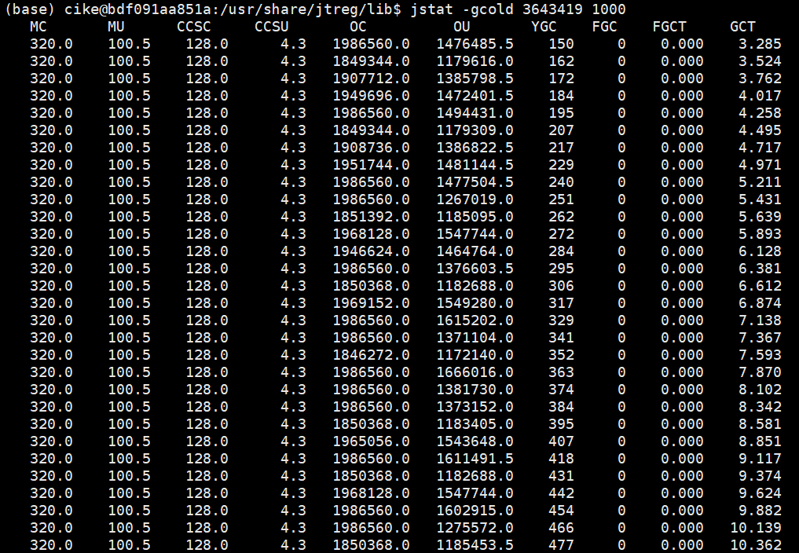
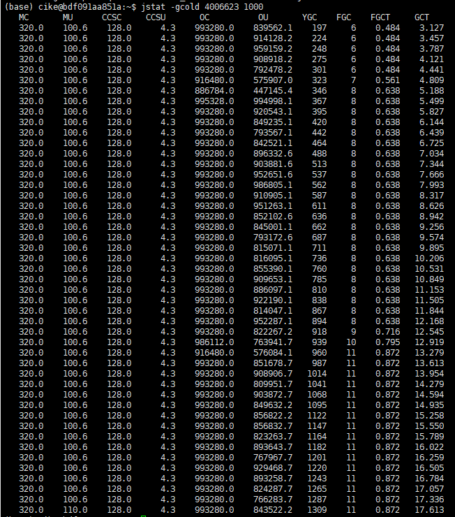

# Task
+ 利用任务二中的一些数据，分析目前情况下G1GC Adaptive IHOP的原理以及对于mixed GC的影响。
根据相关数据，尝试优化一些mixed GC的参数的数值，使其能够根据Java进程的运行状态同样的进行动态调整。

# Environment
+ Ubuntu 18.04.6 LTS
+ java-17-openjdk-amd64


# LRU Cache
+ [LRU cache](../demo/src/main/java/com/example/LRUCache.java)的类实现
+ [LRU cache](../demo/src/main/java/com/example/LRUCache_test.java)的测试

# Settings of tested data
+ value：1024 bytes
+ cache_size:400000
+ test_size: 100000000

# Test cases
## ```Case 1```:
+ 任务二中，配置为：
    ```json
    "vmArgs": [
        "-Xlog:gc*:log/log_pro2/gc-G1-%t.log:time,level,tags",
        "-XX:+UseG1GC",
        "-Xmx1G"
    ],
    ```
    ```
    [gc] Using G1
    [gc,init] Version: 17.0.7+7-Ubuntu-0ubuntu118.04 (release)
    [gc,init] CPUs: 104 total, 104 available
    [gc,init] Memory: 251G
    [gc,init] Large Page Support: Disabled
    [gc,init] NUMA Support: Disabled
    [gc,init] Compressed Oops: Enabled (32-bit)
    [gc,init] Heap Region Size: 1M
    [gc,init] Heap Min Capacity: 8M
    [gc,init] Heap Initial Capacity: 1G
    [gc,init] Heap Max Capacity: 1G
    [gc,init] Pre-touch: Disabled
    [gc,init] Parallel Workers: 68
    [gc,init] Concurrent Workers: 17
    [gc,init] Concurrent Refinement Workers: 68
    [gc,init] Periodic GC: Disabled
    ```
+ 运行结果：
    <!-- + 
    + Total time：60820ms -->
    + Total time:49662ms
    + 
+ 分析：
    + 在该测试用例下，Adaptive IHOP机制通过动态调整启动Mixed GC的堆占用比以优化垃圾回收的触发时机，从而通过及时的Mixed GC操作减少Full GC的次数，以保持GC性能的稳定性。但是由于在该用例下，垃圾生成的速度高于Mixed GC的速度，从而触发了较多次数的Full GC。可以考虑对堆大小以及Mixed GC的参数进行调整

## ```Case 2```：
+ 基于case1，设置最大堆大小为2G,即配置为：
    ```json
    "vmArgs": [
        "-Xlog:gc*:log/log_pro3/gc-%t.log:time,level,tags",
        "-XX:+UseG1GC",
        "-XX:+G1UseAdaptiveIHOP",
        "-Xmx2G", 
        "-XX:+UnlockExperimentalVMOptions",
    ],
    ```
+ 运行结果：
    + Total time： 41661ms
    + 
+ 分析：
    + 将最大堆大小由1G修改为2G，根据测试结果可以对比发现，进程总时间从49662ms降为41661，GC总消耗时间从19.193降为11.210。且未发生Full GC现象，YGC次数减少。同时由于堆空间的增大，Young GC平均时间开销增大。运行过程中，survivor 1区域仍处于饱和状态，eden区域具有较多的空余空间，老年代区域空间仍有空余。GC速度能够跟上程序的垃圾产生速度，从而避免Full Gc导致的STW现象，进而减少程序运行时间开销。


## ```Case 3```：
+ -XX:G1MixedGCLiveThresholdPercent
+ 基于Case2，我们考虑对老年代区域中活跃对象的百分比阈值（即G1MixedGCLiveThresholdPercent）进行调整，默认为85%，即如果老年代区域中超过85%的对象是活跃的，则该区域不会被回收。
### Setting 3_1:
+ -Xmx2G
+ 降低阈值：-XX:G1MixedGCLiveThresholdPercent=70
+ result：
    + Total time: 41972ms
    + 
    + 更积极地对老年代区域进行回收,对比case2的GCT,将阈值降低为70后,程序运行时间由41661ms略微上升为41972ms; GCT由11.210下降为10.362,且老年代区域剩余空间相对较多
### Setting 3_2:
+ -Xmx2G
+ 提高阈值： -XX:G1MixedGCLiveThresholdPercent=90
+ result：
    + Total time：45308ms
    + 
    + 减少GC开销并延长GC间隔, 对比case2,提高阈值为90%后,程序运行时间由41661ms上升为45308ms; GCT由11.210下降为10.453,但老年代区域使用空间较大
### Setting 3_3：
+ -Xmx1G, 基于Case1，最大堆为1G
+ 提高阈值： -XX:G1MixedGCLiveThresholdPercent=70
+ result：
    + Total time：50307ms
    + 
    + 更积极地对老年代区域进行回收,程序运行时间由49662ms略微上升为50307,Full GC次数由51下降为49, GCT由19.193下降为18.894
### Setting 3_4：
+ -Xmx1G, 基于Case1，最大堆为1G
+ 提高阈值： -XX:G1MixedGCLiveThresholdPercent=90
+ result：
    + Total time：53009ms
    + 
    + 减少GC开销并延长GC间隔，程序运行时间由49662ms略微上升为53009ms,且FullGC次数由51次下降为12次, GCT由17.562略微下降为17.054
### conclusion:
+ 对于频繁出现full GC的case1,适当调整G1MixedGCLiveThresholdPercent虽然能够降低GCT,以及减少full gc次数从而减少STW事件,但是程序运行时长略微增加.
+ 对于最大堆设置为2G的case2,实验中对G1MixedGCLiveThresholdPercent的调整虽然能够降低GCT,但是额外增加了程序整体运行时间.

## ```Case 4```:
+ -XX:G1OldCSetRegionThresholdPercent
+ 基于case1与case2,我们考虑对老年代区域数量进行调整,默认为10%. 通过设置该次数,可以限制每次Mixed GC的工作量,从而避免一次GC处理过多的老年代区域
### Setting 4_1
+ -Xmx2G
+ -XX:G1OldCSetRegionThresholdPercent=6
+ result：
    + Total time：42303ms
    + 
    + 将该参数降低为6%，会减少每次Mixed GC的回收量，减少GC暂停时间，程序运行时间从41661ms略微上升为42303ms，GCT从11.21s下降为10.533,同时可以看出老年代区域的数量增加

### Setting 4_2
+ -Xmx2G
+ -XX:G1OldCSetRegionThresholdPercent=15
+ result：
    + Total time：40044ms
    + 
    + 将参数提升为15%，可以使更多的老年代区域参与回收，减少老年代区域的碎片；程序运行时间从41661下降为40044，GCT由11.210下降为10.533，老年代区域使用率下降
### Setting 4_3
+ -Xmx1G, 基于Case1，最大堆为1G
+ -XX:G1OldCSetRegionThresholdPercent=6
+ result：
    + Total time：49356ms
    + 
    + 降低参数为6%，程序运行时间由49662变化为49356，Full GC次数由51上升为69次，GCT由19.193上升为20.000，
### Setting 4_4
+ -Xmx1G, 基于Case1，最大堆为1G
+ -XX:G1OldCSetRegionThresholdPercent=15
+ result：
    + Total time：48141ms
    + 
    + 提升参数为15%，程序运行时间由49662下降为48141ms，由于GC时更多的老年代参与回收，老年代区域使用比例下降，full GC次数由51下降为22次，GCT由19.193下降为17.049
### Conclusion
+ 根据以上测试，适当降低老年区域阈值，可以减少MixedGC的回收量，，但可能导致fullGC次数的增加
+ 适当提升老年代区域阈值，可以使更多的老年代区域进行回收，减少fullGC的次数，降低GCT，并减少程序运行时间
## ```Case 5```:
+ -XX:G1MixedGCCountTarget
+ 基于case1与case2,我们考虑对Mixed Gc的次数进行调整,默认为8次. 通过设置该次数,可以使G1GC在指定周期内尝试执行相应次数的Mixed GC, 尽可能回收老年代的垃圾
### Setting 5_1
+ -Xmx2G
+ -XX:G1MixedGCCountTarget=4
+ result：
    + Total time：47048ms
    + 
    + 将MixedGC目标次数降低为4，可以缓解Mixed GC导致的暂停时间过长问题，程序运行时间由41661ms上升为47048ms，GCT从11.210略微下降为11.062s
### Setting 5_2
+ -Xmx2G
+ -XX:G1MixedGCCountTarget=12
+ result：
    + Total time：40808
    + 
    + 将MixedGC目标次数提升为12，可以使老年代的垃圾更快的回收；程序运行时间由41661下降为40808，GCT从11.210下降为9.936
### Setting 5_3
+ -Xmx1G, 基于Case1，最大堆为1G
+ -XX:G1MixedGCCountTarget=4
+ result：
    + Total time：51621ms
    + 
    + 将MixedGC目标次数降低为4，Mixed GC频率降低，GCT由19.193下降为15.962,程序运行时间由49662略微上升为51621ms。
### Setting 5_4
+ -Xmx1G, 基于Case1，最大堆为1G
+ -XX:G1MixedGCCountTarget=12
+ result：
    + Total time：48212ms
    + 
    + 将mixedGC目标次数提升为12，提高mixedGC频率，fullGC次数略微下降，GCT时间略微下降为18.862
### Conclusion
+ 适当减少周期中目标MixedGC的最大次数可以缓解MixedGC导致的暂停时间过长的问题
+ 适当增加周期中目标mixedGC的最大次数可以更快地回收老年代的垃圾，减少fullGC的次数

## ```Case 6```:
-XX:MaxGCPauseMillis
+ 基于case1与case2,我们考虑对Mixed Gc的暂停时间进行调整,默认为200ms,通过调整MixedGC的工作量来满足GC的目标
### Setting 6_1
+ -Xmx2G
-XX:MaxGCPauseMillis=100
+ result：
    + Total time：45924ms
    + 
    + 降低MixedGC暂停的目标时间为100ms，GCT时间由11.210下降为9.393，但老年代区域回收少，程序运行时间由41661上升为45924ms
### Setting 6_2
+ -Xmx2G
-XX:MaxGCPauseMillis=300
+ result：
    + Total time：46050ms
    + 
    + 提升mixedGC暂停的目标时间为300ms，可以的得到更好的老年代回收效果，老年代区域使用占比降低
### Setting 6_3
+ -Xmx1G, 基于Case1，最大堆为1G
-XX:MaxGCPauseMillis=100
+ result：
    + Total time：53889ms
    + 
    + 降低MixedGC暂停的目标时间为100ms，程序运行时间由49662上升为53889，老年代区域的使用率较高
### Setting 6_4
+ -Xmx1G, 基于Case1，最大堆为1G
-XX:MaxGCPauseMillis=300
+ result：
    + Total time：55050ms
    + 
    + 提升mixedGC暂停的目标时间，减少老年代区域的使用率，fullGC的次数由51明显下降为11次。程序运行时间由49662上升为55050.
### Conclusion
+ 对于暂停时间敏感的应用，可以考虑适当降低mixedGc暂停时间，但会带来老年代区域使用率高的可能性。
+ 对于可以接收较长暂停时间的应用，可以考虑适当提升mixedGC的暂停时间，获得更好的老年代回收效果，进而减少fullGC的次数，减少程序运行时间

## ```Case 7```:
+ -XX:G1HeapWastePercent
+ 基于case1与case2,我们考虑对G1GC中允许堆被浪费的百分比进行调整,默认为5%,如果老年代的未使用部分超过这个百分比,就会触发mixedGC
### Setting 7_1
+ -Xmx2G
+ -XX:G1HeapWastePercent=3
+ result：
    + Total time：46349ms
    + 
    + 降低该参数为3%，可以使mixedGC的触发频率提升，但可能会带来STW事件的增多。程序运行时间由41661上升为46349ms。
### Setting 7_2
+ -Xmx2G
+ -XX:G1HeapWastePercent=10
+ result：
    + Total time：46521ms
    + 
    + 提升该参数可以降低mixedGC频率，GCT由11.210下降为9.473，程序运行时间由41661上升为46521ms
### Setting 7_3
+ -Xmx1G, 基于Case1，最大堆为1G
+ -XX:G1HeapWastePercent=3
+ result：
    + Total time：53302ms
    + 
    + 降低该参数可以减少空间浪费，提升MixedGC频率，FullGC次数由51次下降为12次，GCT由19.193下降为17.982s。程序运行时间由49662上升为53302ms
### Setting 7_4
+ -Xmx1G, 基于Case1，最大堆为1G
+ -XX:G1HeapWastePercent=10
+ result：
    + Total time：47565ms
    + 
    + 提高该参数可以减少GC频率，减少STW事件。程序运行时间由49662下降为47565ms，fullGC次数由19.193下降为17.959.
### Conclusion
+ 适当降低该参数可以更加频繁地触发MixedGC，从而显著减少FullGC的调用速度，减少老年代区域的使用率，但可能带来程序运行时间的上升以及STW事件的增加
+ 适当提升该参数可以适当降低MixedGC的频率。但可能导致老年代区域未及时回收而频繁触发fullGC的问题

## ```Case 8```
+ 综合以上分析，基于case 1，我们的优化策略是更积极地对老年代区域进行回收，触发mixedGC从而减少老年代使用率，避免FullGC的触发，进而减少STW事件，降低程序的运行事件。
+ 我们考虑对以下参数进行调整与优化：
### Settings:
```json
    "vmArgs": [
        "-Xlog:gc*:log/log_pro3/gc-case7_4-%t.log:time,level,tags",
        "-XX:+UseG1GC",
        "-XX:+G1UseAdaptiveIHOP",
        "-Xmx2G", 
        "-XX:+UnlockExperimentalVMOptions",
        "-XX:G1MixedGCLiveThresholdPercent=80",
        "-XX:G1OldCSetRegionThresholdPercent=13",
        "-XX:G1MixedGCCountTarget=10",
        "-XX:MaxGCPauseMillis=250",
        "-XX:G1HeapWastePercent=4",
    ],
```
### Result
+ Total time:45686ms
+ 
### Conclusion
+ 通过该设置，我们将最大堆大小从1G提升为2G，并降低老年代存活对象阈值为80%，将老年代区域数量提升为13%，将MixedGC的目标次数提升为10次，提升mixedGC的暂停时间为250ms，从而更加积极地对老年代区域进行回收。
+ 根据实验结果，与case 1对比，调优后的运行结果在运行时间由49662ms显著下降为45686ms，通过更积极的老年代区域回收，降低老年代区域的占有率，从而减少Full GC的触发，使FullGC的触发次数由51次降为0次。另外优化后的GC策略有效地降低了GCT，使其从19.193s下降为10.522，有效减少了STW事件。